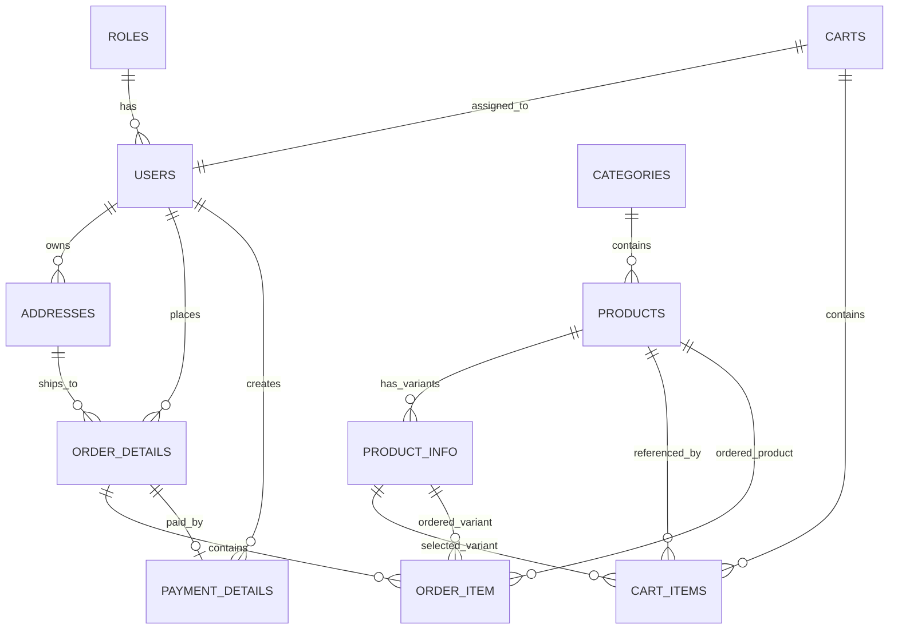
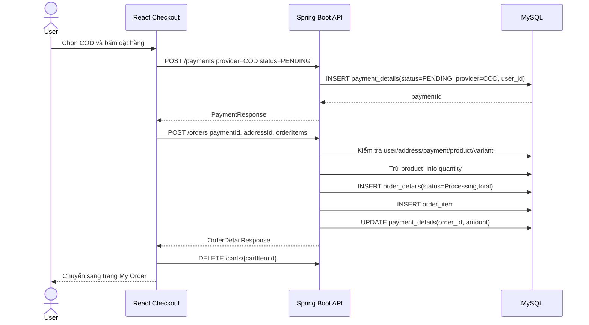
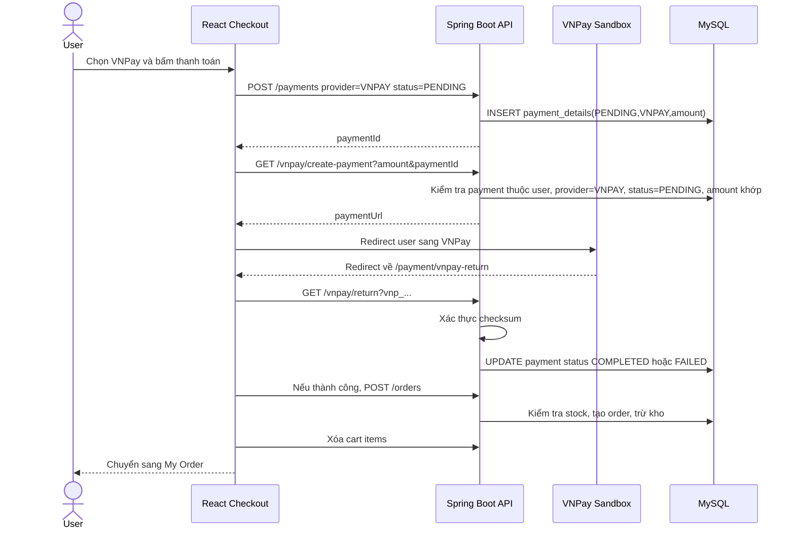

# Hướng dẫn ôn thi vấn đáp project CreaTShop

Tài liệu này giải thích project CreaTShop theo hướng phục vụ vấn đáp: hiểu nghiệp vụ, hiểu luồng xử lý, hiểu vì sao thiết kế database như hiện tại, và chuẩn bị cách trả lời khi thầy hỏi sâu.

Nguồn phân tích chính:

- Backend: `CreaTShop-server/creatshop/src/main/java/com/example/creatshop`
- Schema/seed DB: `CreaTShop-server/creatshop/db/init/init.sql`
- Frontend flow checkout/order: `CreaTShop-Client/src/pages/CheckOut.jsx`, `PaymentReturn.jsx`, `MyOrder.jsx`
- Admin order: `CreaTShop-Client/src/components/Admin/AdminOrder.jsx`
- Kế hoạch COD: `COD_PAYMENT_PLAN.md`

## 1. Tổng quan project

CreaTShop là một website thương mại điện tử cho cửa hàng giày/thời trang. Hệ thống có 2 nhóm người dùng chính:

| Nhóm | Vai trò |
|:--|:--|
| Khách hàng | Đăng ký, đăng nhập, xem sản phẩm, chọn biến thể, thêm giỏ hàng, quản lý địa chỉ, đặt hàng, thanh toán COD hoặc VNPay, xem/hủy đơn |
| Admin | Quản lý sản phẩm, biến thể, danh mục, người dùng, đơn hàng, chuyển trạng thái đơn, xác nhận COD đã thu tiền |

Luồng tổng thể:

```text
Browser React/Vite
        |
        | HTTP JSON / multipart form-data
        | Authorization: Bearer <JWT>
        v
Spring Boot REST API (/api/v1)
        |
        | Controller -> Service -> Repository -> MySQL
        |
        +-- Cloudinary: upload ảnh sản phẩm/biến thể
        +-- VNPay sandbox: tạo URL thanh toán và xác thực callback
        v
MySQL
```

Project dùng kiến trúc nhiều lớp:

| Lớp | Nhiệm vụ |
|:--|:--|
| Controller | Nhận request, lấy path/query/body, gắn `@Valid`, gọi service |
| Service | Xử lý nghiệp vụ thật: tạo user, tính tổng tiền, trừ kho, kiểm tra quyền sở hữu, chuyển trạng thái |
| Repository | Truy vấn DB qua Spring Data JPA |
| Entity | Mapping bảng DB bằng JPA/Hibernate |
| DTO | Request/Response object, tránh trả thẳng entity ra ngoài |
| Mapper | MapStruct chuyển đổi Entity <-> DTO |
| Security | JWT filter, phân quyền endpoint, xử lý 401/403 |
| Exception | Bọc lỗi thành response thống nhất |

## 2. Công nghệ sử dụng

| Phần | Công nghệ |
|:--|:--|
| Frontend | React 18, Vite, React Router, Redux Toolkit |
| UI/Form | Tailwind CSS, SCSS, Formik, Yup, React Hot Toast |
| Backend | Java, Spring Boot 3.3.3 |
| API | Spring Web REST |
| ORM | Spring Data JPA, Hibernate |
| DB | MySQL |
| Auth | Spring Security, JWT |
| Mapping | MapStruct |
| Upload ảnh | Cloudinary |
| Thanh toán | COD, VNPay sandbox |
| API docs | Springdoc OpenAPI/Swagger UI |
| Deploy local | Docker/Docker Compose |

## 3. Các module nghiệp vụ chính

| Module | File/service chính | Ý nghĩa |
|:--|:--|:--|
| Auth | `AuthServiceImpl` | Đăng nhập, phát JWT, chặn tài khoản bị khóa |
| User | `UserServiceImpl` | Đăng ký, xem/sửa hồ sơ, khóa/mở tài khoản |
| Category | `CategoryServiceImpl` | Quản lý danh mục MEN/WOMEN/BOY/GIRL |
| Product | `ProductServiceImpl` | Quản lý sản phẩm, upload ảnh, gắn category |
| Variant | `ProductVariantServiceImpl` | Quản lý biến thể màu/size/tồn kho |
| Cart | `CartItemServiceImpl` | Thêm/sửa/xóa sản phẩm trong giỏ |
| Address | `AddressServiceImpl` | Quản lý địa chỉ giao hàng theo user |
| Payment | `PaymentServiceImpl` | Tạo payment COD/VNPAY, cập nhật trạng thái, xác nhận COD |
| Order | `OrderDetailServiceImpl` | Tạo đơn, tính tổng tiền, trừ/hoàn kho, chuyển trạng thái |
| VNPay | `VNPayService` | Tạo URL VNPay, xác thực checksum, cập nhật payment |

## 4. Thiết kế database

Database được thiết kế theo hướng tách từng khái niệm nghiệp vụ thành bảng riêng:

- User, role, cart, address được tách riêng để quản lý tài khoản.
- Product được tách khỏi ProductVariant để một sản phẩm có nhiều màu/size/tồn kho.
- OrderDetail được tách khỏi OrderItem để một đơn có nhiều dòng hàng.
- PaymentDetail được tách khỏi OrderDetail để xử lý được nhiều phương thức thanh toán.
- Address được gắn vào order để biết đơn giao tới địa chỉ nào.

### 4.1. Sơ đồ ERD rút gọn



### 4.2. Bảng `roles`

Mục đích: lưu vai trò phân quyền.

| Cột | Ý nghĩa |
|:--|:--|
| `id` | Khóa chính |
| `role_type` | `ROLE_ADMIN` hoặc `ROLE_USER`, unique |
| `description` | Mô tả vai trò |
| `created_at`, `updated_at` | Audit thời gian |

Quan hệ:

- 1 role có nhiều user.
- User được phân quyền dựa vào role này.

Khi đăng ký user mới, backend mặc định gán `ROLE_USER`.

### 4.3. Bảng `users`

Mục đích: lưu tài khoản người dùng.

| Cột | Ý nghĩa |
|:--|:--|
| `id` | UUID dạng `CHAR(36)`, khóa chính |
| `username` | Tên đăng nhập, unique, không update |
| `password` | Mật khẩu đã encode bằng `PasswordEncoder` |
| `first_name`, `last_name` | Họ tên |
| `email` | Email, unique |
| `phone_number` | Số điện thoại |
| `date_of_birth` | Ngày sinh |
| `status` | `ACTIVE` hoặc `BANNED` |
| `role_id` | FK tới `roles.id` |
| `cart_id` | FK unique tới `carts.id` |
| `created_at`, `updated_at` | Audit thời gian |

Điểm cần nhớ khi vấn đáp:

- Không lưu password plain text, chỉ lưu bản mã hóa.
- `username` và `email` unique để tránh trùng tài khoản.
- `status = BANNED` dùng để khóa tài khoản. Khi login, nếu user không `ACTIVE` thì backend không trả token hợp lệ cho client.
- Mỗi user có một cart riêng thông qua `cart_id`.

### 4.4. Bảng `carts`

Mục đích: đại diện giỏ hàng của user.

| Cột | Ý nghĩa |
|:--|:--|
| `id` | Khóa chính |
| `created_at`, `updated_at` | Audit thời gian |

Quan hệ:

- 1 user có 1 cart.
- 1 cart có nhiều cart item.

Vì sao cần bảng `carts` riêng?

- Giúp gom nhiều `cart_items` của cùng một user.
- Nếu sau này muốn lưu thêm mã giảm giá, trạng thái giỏ, thời điểm cập nhật giỏ, có thể mở rộng ngay tại bảng này.

### 4.5. Bảng `cart_items`

Mục đích: lưu từng sản phẩm/biến thể trong giỏ hàng.

| Cột | Ý nghĩa |
|:--|:--|
| `id` | Khóa chính |
| `cart_id` | FK tới giỏ hàng |
| `product_id` | FK tới sản phẩm |
| `product_variant_id` | FK tới biến thể sản phẩm |
| `quantity` | Số lượng user muốn mua |

Quan hệ:

- Nhiều cart item thuộc 1 cart.
- Mỗi cart item tham chiếu 1 product và 1 variant.

Điểm nghiệp vụ:

- Khi thêm vào giỏ, backend kiểm tra product tồn tại, variant tồn tại, và variant phải thuộc product đó.
- Tồn kho chưa bị trừ ở bước thêm giỏ. Tồn kho chỉ bị trừ khi tạo order thành công.
- Frontend đang tự xử lý nếu item đã tồn tại thì gọi update quantity thay vì tạo item trùng.

### 4.6. Bảng `categories`

Mục đích: phân loại sản phẩm.

| Cột | Ý nghĩa |
|:--|:--|
| `id` | Khóa chính |
| `name` | Tên danh mục, ví dụ Hunter, Sandal |
| `description` | Mô tả |
| `category_type` | `MEN`, `WOMEN`, `BOY`, `GIRL` |
| `created_at`, `updated_at` | Audit thời gian |

Quan hệ:

- 1 category có nhiều product.
- 1 product thuộc 1 category.

Điểm cần nhớ:

- API `GET /categories` trả danh mục được group theo `category_type`.
- Khi tạo/sửa category, service kiểm tra trùng theo cặp `name + type`.

### 4.7. Bảng `products`

Mục đích: lưu thông tin sản phẩm cấp cha.

| Cột | Ý nghĩa |
|:--|:--|
| `id` | Khóa chính |
| `category_id` | FK tới `categories.id` |
| `name` | Tên sản phẩm |
| `price` | Giá sản phẩm |
| `image_static_url` | Ảnh chính |
| `image_dynamic_url` | Ảnh hover/ảnh phụ |
| `created_at`, `updated_at` | Audit thời gian |

Quan hệ:

- 1 product thuộc 1 category.
- 1 product có nhiều biến thể trong bảng `product_info`.

Vì sao không đưa màu/size/tồn kho vào `products`?

Vì một sản phẩm thực tế có thể có nhiều size, nhiều màu, mỗi tổ hợp có số lượng tồn kho khác nhau. Nếu để trong `products`, dữ liệu sẽ bị lặp và khó kiểm soát tồn kho. Vì vậy product chỉ giữ thông tin chung: tên, giá, ảnh, category. Biến thể giữ màu, size, quantity.

### 4.8. Bảng `product_info`

Trong code entity tên là `ProductVariant`, nhưng bảng DB tên là `product_info`.

Mục đích: lưu biến thể của sản phẩm.

| Cột | Ý nghĩa |
|:--|:--|
| `id` | Khóa chính |
| `product_id` | FK tới `products.id` |
| `color` | Màu |
| `name` | Tên biến thể, thường set theo tên product |
| `size` | Size |
| `quantity` | Tồn kho của biến thể |
| `image_url` | Ảnh riêng của biến thể |
| `created_at`, `updated_at` | Audit thời gian |

Điểm nghiệp vụ rất quan trọng:

- Tồn kho nằm ở biến thể, không nằm ở product.
- Khi user mua size 40 màu đen thì phải trừ đúng row variant đó.
- Khi tạo order, backend kiểm tra `variant.product.id == product.id` để tránh client gửi product A nhưng variant của product B.
- Khi admin xóa biến thể cuối cùng của product, service hiện tại xóa luôn product.

### 4.9. Bảng `addresses`

Mục đích: lưu địa chỉ giao hàng của user.

| Cột | Ý nghĩa |
|:--|:--|
| `id` | Khóa chính |
| `user_id` | FK tới user |
| `first_name`, `last_name` | Người nhận |
| `phone_number` | Số điện thoại nhận hàng |
| `country`, `city`, `district`, `commune` | Khu vực |
| `address_detail` | Số nhà/đường |
| `description` | Ghi chú |

Quan hệ:

- 1 user có nhiều address.
- 1 order chọn 1 address để giao hàng.

Điểm bảo mật:

- Khi lấy/sửa/xóa address, service kiểm tra address đó có thuộc user đang đăng nhập không.
- Khi tạo order, service cũng kiểm tra `address.user.username == username`.

### 4.10. Bảng `payment_details`

Mục đích: lưu thông tin thanh toán.

| Cột | Ý nghĩa |
|:--|:--|
| `id` | Khóa chính |
| `user_id` | User tạo payment |
| `order_id` | FK unique tới `order_details.id` |
| `amount` | Số tiền thanh toán |
| `provider` | `COD` hoặc `VNPAY` |
| `status` | `PENDING`, `COMPLETED`, `FAILED`, `CANCELED` |
| `created_at`, `updated_at` | Audit thời gian |

Quan hệ:

- 1 user có thể tạo nhiều payment.
- 1 payment chỉ được gắn với tối đa 1 order.
- `order_id` unique giúp 1 order không có nhiều payment trong schema hiện tại.

Luồng trạng thái payment:

```text
PENDING -> COMPLETED
PENDING -> FAILED
PENDING -> CANCELED
```

Điểm nghiệp vụ quan trọng:

- Khi tạo payment, backend luôn set `status = PENDING`, không tin `status` client gửi lên.
- Client không được tự set `COMPLETED`. Service `updatePayment` chặn trạng thái `COMPLETED`; chỉ hệ thống VNPay hoặc admin xác nhận COD mới được hoàn tất.
- Với COD, payment giữ `PENDING` cho đến khi đơn `Delivered` và admin xác nhận đã thu tiền.
- Với VNPay, payment có thể chuyển `COMPLETED` sau khi VNPay return/IPN xác thực thành công.

### 4.11. Bảng `order_details`

Mục đích: lưu thông tin đơn hàng cấp cha.

| Cột | Ý nghĩa |
|:--|:--|
| `id` | Khóa chính |
| `user_id` | FK tới user đặt hàng |
| `address_id` | FK tới địa chỉ giao hàng |
| `total` | Tổng tiền backend tự tính |
| `status` | `Processing`, `Shipped`, `Delivered` |
| `created_at`, `updated_at` | Audit thời gian |

Quan hệ:

- 1 user có nhiều order.
- 1 order có nhiều order item.
- 1 order dùng 1 address.
- 1 order có 1 payment thông qua `payment_details.order_id`.

Luồng trạng thái order:

```text
Processing -> Shipped -> Delivered
```

Code dùng State Pattern:

- `ProcessingState.next()` chuyển sang `Shipped`
- `ShippedState.next()` chuyển sang `Delivered`
- `DeliveredState.next()` báo lỗi vì đã là trạng thái cuối
- `ProcessingState.prev()` báo lỗi vì đã là trạng thái đầu

Điểm cần nhớ:

- Project hiện chưa có trạng thái order `Canceled`; việc hủy đơn được biểu diễn bằng `payment.status = CANCELED` và hoàn lại kho.
- Đây là điểm nếu thầy hỏi có thể nói: trong bản hiện tại, cancel tập trung ở payment; nếu nâng cấp nên thêm `OrderStatus.Canceled` để rõ nghĩa hơn.

### 4.12. Bảng `order_item`

Mục đích: lưu từng dòng sản phẩm trong đơn hàng.

| Cột | Ý nghĩa |
|:--|:--|
| `id` | Khóa chính |
| `order_id` | FK tới order |
| `product_id` | FK tới product |
| `product_variant` | FK tới variant |
| `quantity` | Số lượng mua |
| `created_at`, `updated_at` | Audit thời gian |

Quan hệ:

- 1 order có nhiều order item.
- Mỗi order item tham chiếu product và variant tại thời điểm tạo.

Điểm thiết kế cần biết:

- `order_details.total` được lưu lại tại thời điểm tạo đơn.
- Nhưng `order_item` hiện không có cột `unit_price`. Nếu sau này admin đổi giá product, phần hiển thị product trong order item có thể đọc giá mới, còn `order.total` vẫn là tổng cũ.
- Nếu làm hệ thống production, nên thêm `unit_price` hoặc `price_at_purchase` vào `order_item` để lưu snapshot giá tại thời điểm mua.

## 5. Vì sao thiết kế DB như vậy?

### 5.1. Tách `Product` và `ProductVariant`

Nếu chỉ có bảng `products`, mỗi dòng phải chứa cả size/màu/tồn kho. Khi cùng một mẫu giày có 10 size, ta sẽ phải lặp lại tên, giá, category, ảnh chính 10 lần.

Thiết kế hiện tại tốt hơn vì:

- `products` chứa dữ liệu chung.
- `product_info` chứa dữ liệu thay đổi theo size/màu.
- Tồn kho chính xác đến từng biến thể.
- Giỏ hàng và đơn hàng chọn đúng variant cụ thể.

### 5.2. Tách `OrderDetail` và `OrderItem`

Một đơn hàng có nhiều sản phẩm. Nếu chỉ có một bảng order, sẽ khó lưu nhiều dòng hàng.

Thiết kế hiện tại:

- `order_details`: thông tin chung của đơn như user, address, total, status.
- `order_item`: từng sản phẩm trong đơn.

Đây là mô hình chuẩn trong thương mại điện tử.

### 5.3. Tách `PaymentDetail` khỏi `OrderDetail`

Payment có vòng đời riêng:

- COD: tạo order trước, thu tiền sau.
- VNPay: thanh toán online, có thể thành công/thất bại, có callback.

Nếu trộn payment vào order, xử lý trạng thái sẽ kém linh hoạt. Tách bảng giúp:

- Lưu provider `COD`/`VNPAY`.
- Lưu status thanh toán riêng với status giao hàng.
- Admin có thể xác nhận COD sau khi giao.
- VNPay có thể cập nhật `COMPLETED` hoặc `FAILED` độc lập.

### 5.4. Tách `Address`

User có thể có nhiều địa chỉ. Order cần biết giao tới địa chỉ nào.

Hiện tại order tham chiếu `address_id`. Cách này đơn giản, nhưng có một điểm cần lưu ý: nếu user sửa address sau khi đặt hàng, dữ liệu địa chỉ trong order có thể bị ảnh hưởng khi đọc lại. Trong hệ thống thật, thường nên snapshot địa chỉ giao hàng vào order hoặc bảng riêng để giữ lịch sử chính xác.

### 5.5. Tính tổng tiền ở backend

Frontend gửi `orderItems` gồm `productId`, `variantId`, `quantity`, nhưng không gửi tổng tiền làm nguồn tin chính.

Backend tự tính:

```text
total = sum(product.price * item.quantity)
```

Lý do:

- Client có thể bị chỉnh sửa request.
- Nếu tin tổng tiền từ client, user có thể sửa giá thành 0.
- Backend mới là nơi đáng tin vì đọc giá thật từ DB.

Đây là câu trả lời rất quan trọng khi thầy hỏi về an toàn nghiệp vụ.

## 6. Luồng đăng ký, đăng nhập và phân quyền

### 6.1. Đăng ký

Endpoint:

```text
POST /api/v1/users
```

Luồng xử lý:

1. Frontend gửi `UserRequest`.
2. Bean Validation kiểm tra first name, last name, username, password, email, phone.
3. `UserServiceImpl.createUser` map request sang entity.
4. Nếu chưa có role `ROLE_USER`, backend tạo role này.
5. Gán role `ROLE_USER`.
6. Encode password bằng `PasswordEncoder`.
7. Set `status = ACTIVE`.
8. Save user.
9. Nếu user chưa có cart thì tạo `Cart`, gắn cart vào user.
10. Trả `UserResponse`.

Password pattern hiện tại:

```text
8-16 ký tự, có chữ hoa, chữ thường, số và ký tự đặc biệt
```

Phone pattern:

```text
Bắt đầu bằng 0, tổng 10-15 chữ số
```

### 6.2. Đăng nhập

Endpoint:

```text
POST /api/v1/auths/login
```

Luồng xử lý:

1. Frontend gửi username/password.
2. `AuthenticationManager` xác thực.
3. Nếu đúng, backend tạo JWT.
4. Backend lấy user đang đăng nhập.
5. Nếu `status = ACTIVE`, trả access token và roles.
6. Nếu user bị `BANNED`, ném lỗi tài khoản bị khóa.

Response thành công:

```json
{
  "meta": {
    "status": "SUCCESS"
  },
  "data": {
    "accessToken": "...",
    "type": "Bearer",
    "roles": "ROLE_USER"
  }
}
```

Frontend lưu token và roles vào Redux/localStorage.

### 6.3. JWT và Security

Mỗi request cần đăng nhập gửi header:

```http
Authorization: Bearer <token>
```

`AuthTokenFilter` làm các việc:

1. Đọc header `Authorization`.
2. Cắt prefix `Bearer ` để lấy token.
3. Validate token bằng `JwtUtils`.
4. Lấy username từ token.
5. Load user bằng `UserDetailsService`.
6. Đưa authentication vào `SecurityContextHolder`.

Phân quyền chính:

| API | Quyền |
|:--|:--|
| `POST /auths/login` | Public |
| `POST /users` | Public |
| `GET /categories/**` | Public |
| `GET /products/**` | Public |
| `GET /variants/**` | Public |
| `/carts/**` | Authenticated |
| `/addresses/**` | Authenticated |
| `/orders/**` | Authenticated, admin cho một số API |
| `/payments/**` | Authenticated |
| Ghi/xóa category/product/variant | `ROLE_ADMIN` |
| `GET /users`, lock/unlock user | `ROLE_ADMIN` |

Lưu ý khi vấn đáp: frontend có `AdminRoute` để chặn giao diện admin, nhưng bảo mật thật vẫn nằm ở backend bằng Spring Security và `@PreAuthorize`.

## 7. Luồng xem sản phẩm và thêm giỏ hàng

### 7.1. Xem danh sách/chit tiết sản phẩm

Các API public:

```text
GET /api/v1/products
GET /api/v1/products/{productId}
GET /api/v1/variants/product/{productId}
GET /api/v1/categories
```

Luồng:

1. User vào trang shop.
2. Frontend gọi API lấy products/categories.
3. Khi vào detail, frontend gọi `GET /products/{id}`.
4. Response product có danh sách variants.
5. User chọn variant cụ thể: size, màu, tồn kho.

### 7.2. Thêm vào giỏ hàng

Endpoint:

```text
POST /api/v1/carts
```

Payload:

```json
{
  "productId": 1,
  "variantId": 3,
  "quantity": 2
}
```

Backend kiểm tra:

1. User tồn tại theo JWT username.
2. Quantity > 0.
3. Product tồn tại.
4. Variant tồn tại.
5. Variant phải thuộc product.
6. Tạo `CartItem` thuộc cart của user.

Điểm cần nhấn mạnh:

- Giỏ hàng không trừ tồn kho.
- Giỏ hàng là ý định mua, chưa phải giao dịch.
- Tồn kho chỉ được đảm bảo tại bước tạo order.

## 8. Luồng checkout COD

COD là thanh toán khi nhận hàng. Đặc điểm: đơn hàng được tạo ngay, payment ở trạng thái chờ thanh toán.

### 8.1. Sequence COD



### 8.2. Các bước chi tiết

Frontend `CheckOut.jsx`:

1. Lấy cart qua `GET /carts`.
2. Lấy address qua `GET /addresses`.
3. Bắt buộc chọn hoặc tạo địa chỉ.
4. Nếu cart rỗng thì không cho đặt.
5. Nếu chọn COD:
   - Gọi `POST /payments` với `provider = COD`.
   - Gọi `POST /orders` với `paymentId`, `addressId`, `orderItems`.
   - Xóa cart items sau khi order thành công.
   - Chuyển sang `/my-order`.

Backend `PaymentServiceImpl.createPayment`:

1. Lấy user từ username trong JWT.
2. Validate provider là `COD` hoặc `VNPAY`.
3. Set provider chuẩn uppercase.
4. Luôn set `status = PENDING`.
5. Lưu payment.

Backend `OrderDetailServiceImpl.createOrder`:

1. Lấy user theo JWT.
2. Lấy address theo `addressId`.
3. Kiểm tra address thuộc user.
4. Lấy payment theo `paymentId`.
5. Kiểm tra payment thuộc user.
6. Kiểm tra payment chưa gắn với order nào.
7. Với COD, payment phải đang `PENDING`.
8. Duyệt từng item:
   - Product tồn tại.
   - Variant tồn tại.
   - Variant thuộc đúng product.
   - Tồn kho variant đủ.
   - Tính tiền bằng `product.price * quantity`.
   - Trừ tồn kho variant.
9. Set order total.
10. Set order status `Processing`.
11. Update `payment.amount = total`.
12. Save order.
13. Gắn payment với order.
14. Save order items.
15. Trả response.

### 8.3. Trạng thái COD

```text
Payment: PENDING
Order: Processing
```

Sau đó admin xử lý:

```text
Processing -> Shipped -> Delivered
```

Khi đơn đã `Delivered`, admin gọi:

```text
PUT /api/v1/payments/{paymentId}/confirm-cod
```

Backend chỉ cho xác nhận COD khi:

- Payment provider là `COD`.
- Payment status đang `PENDING`.
- Payment đã gắn với order.
- Order status là `Delivered`.

Sau đó:

```text
Payment: PENDING -> COMPLETED
```

## 9. Luồng checkout VNPay

VNPay là thanh toán online. Khác COD ở chỗ user được redirect sang cổng thanh toán, payment có thể hoàn tất trước khi order được tạo.

### 9.1. Sequence VNPay



### 9.2. Điểm quan trọng trong flow VNPay

`VNPayService.createVnPayPayment` kiểm tra:

- VNPay config hợp lệ.
- `paymentId` không null.
- Payment tồn tại.
- Payment thuộc user đang đăng nhập.
- Provider phải là `VNPAY`.
- Status phải là `PENDING`.
- Amount gửi lên phải khớp với amount trong payment.

`VNPayService.handleReturn`:

- Lấy các tham số `vnp_`.
- Kiểm tra checksum bằng secret.
- Lấy `paymentId` từ `vnp_TxnRef`.
- Kiểm tra amount VNPay trả về khớp DB.
- Nếu response code và transaction status đều `00`, set payment `COMPLETED`.
- Nếu thất bại, set `FAILED`.

`OrderDetailServiceImpl.createOrder` cho phép tạo order khi:

```text
payment.status = PENDING
hoặc payment.status = COMPLETED và provider = VNPAY
```

Lý do có điều kiện thứ hai: với VNPay, payment có thể đã completed trước khi order được tạo.

### 9.3. Rủi ro cần nói được

Trong flow hiện tại, VNPay thanh toán trước rồi frontend mới tạo order sau khi return thành công. Nếu trong khoảng thời gian thanh toán, tồn kho bị người khác mua hết, bước tạo order có thể fail dù payment đã completed.

Cách cải tiến:

- Reserve stock khi bắt đầu thanh toán.
- Hoặc tạo order ở trạng thái chờ thanh toán trước khi redirect VNPay.
- Hoặc nếu payment thành công nhưng order fail, cần quy trình hoàn tiền/thông báo admin.

Đây là câu hỏi rất hay trong vấn đáp.

## 10. Luồng hủy đơn và hoàn kho

Endpoint:

```text
PUT /api/v1/orders/{paymentId}
```

Điều kiện hủy:

- User đã đăng nhập.
- Payment tồn tại.
- Payment status phải là `PENDING`.
- Payment đã gắn với order.
- Order thuộc user hiện tại.

Khi hủy:

1. Lấy order từ payment.
2. Duyệt từng order item.
3. Cộng lại số lượng đã mua vào `ProductVariant.quantity`.
4. Set payment status thành `CANCELED`.
5. Lưu payment.

Điểm cần nhớ:

- Đơn VNPay đã `COMPLETED` không hủy theo flow thường.
- COD đang `PENDING` có thể hủy, vì chưa thu tiền.
- Project hiện không đổi `order.status` sang `Canceled`; chỉ đổi `payment.status = CANCELED`.

## 11. Luồng admin quản lý đơn hàng

Admin page gọi:

```text
GET /api/v1/orders/admin
```

Admin có thể:

| Hành động | API | Điều kiện |
|:--|:--|:--|
| Xem tất cả đơn | `GET /orders/admin` | `ROLE_ADMIN` |
| Chuyển trạng thái tiếp theo | `PUT /orders/{orderId}/status` | `ROLE_ADMIN` |
| Lùi trạng thái | `PUT /orders/{orderId}/status/prev` | `ROLE_ADMIN` |
| Xác nhận COD | `PUT /payments/{paymentId}/confirm-cod` | `ROLE_ADMIN`, order `Delivered`, COD `PENDING` |

State Pattern giúp giới hạn chuyển trạng thái hợp lệ:

```text
Processing --next--> Shipped --next--> Delivered
Delivered --next--> lỗi
Delivered --prev--> Shipped --prev--> Processing
Processing --prev--> lỗi
```

## 12. Luồng admin quản lý sản phẩm, biến thể, danh mục

### 12.1. Tạo sản phẩm

Endpoint:

```text
POST /api/v1/products
Content-Type: multipart/form-data
```

Backend xử lý:

1. Kiểm tra category tồn tại.
2. Map request sang `Product`.
3. Gắn product vào category.
4. Upload `staticImg` và `dynamicImg` lên Cloudinary.
5. Nếu request có variants:
   - Map từng variant.
   - Set variant name bằng product name.
   - Upload ảnh variant.
   - Gắn variant vào product.
6. Save product. Do `cascade = CascadeType.ALL`, variants được lưu cùng.

### 12.2. Cập nhật sản phẩm

Endpoint:

```text
PUT /api/v1/products/{productId}
Content-Type: multipart/form-data
```

Backend xử lý:

- Update field product.
- Nếu có ảnh mới thì upload lại.
- Nếu đổi tên product thì update name của toàn bộ variants thuộc product.

### 12.3. Xóa sản phẩm

Endpoint:

```text
DELETE /api/v1/products/{productId}
```

Backend:

- Xóa toàn bộ variants của product.
- Xóa product.

### 12.4. Xóa variant cuối cùng

Endpoint:

```text
DELETE /api/v1/variants/{variantId}
```

Backend:

- Xóa variant.
- Đếm số variant còn lại của product.
- Nếu không còn variant nào thì xóa luôn product.

Điểm cần giải thích:

- Vì product không có variant thì không thể bán được size/màu nào.
- Tuy nhiên trong hệ thống production, có thể nên giữ product và đánh dấu inactive thay vì xóa cứng để bảo toàn lịch sử.

### 12.5. Xóa category

Backend hiện tại xóa theo dây chuyền:

1. Với từng product trong category.
2. Với từng variant, xóa order item theo variant.
3. Xóa variants.
4. Xóa products.
5. Xóa category.

Điểm cần lưu ý khi vấn đáp:

- Cách này giúp tránh lỗi khóa ngoại khi xóa.
- Nhưng nó có thể ảnh hưởng lịch sử đơn hàng vì xóa order item.
- Hệ thống thật thường dùng soft delete: `active=false`, `deleted_at`, hoặc không cho xóa category đã phát sinh đơn.

## 13. Chuẩn response và xử lý lỗi

API trả response wrapper dạng:

```json
{
  "meta": {
    "status": "SUCCESS",
    "message": "optional"
  },
  "data": {}
}
```

Khi lỗi validation:

```json
{
  "meta": {
    "status": "ERROR",
    "message": "Validation failed"
  },
  "data": {
    "fieldName": "message"
  }
}
```

Các exception chính:

| Exception | Ý nghĩa |
|:--|:--|
| `BadRequestException` | Dữ liệu sai nghiệp vụ |
| `NotFoundException` | Không tìm thấy entity |
| `AlreadyExistsException` | Dữ liệu trùng |
| `SQLUniqueException` | Vi phạm unique DB |
| `UploadFileException` | Upload Cloudinary thất bại |
| `AuthenticationException` | Lỗi xác thực/phân quyền |

Lưu ý: `NotFoundException` hiện đang được map về HTTP `400 Bad Request`, không phải `404`. Nếu thầy hỏi, có thể nói đây là điểm có thể cải tiến để RESTful hơn.

## 14. API chính cần nhớ

| Nhóm | Method | Endpoint | Quyền | Ý nghĩa |
|:--|:--|:--|:--|:--|
| Auth | POST | `/api/v1/auths/login` | Public | Đăng nhập |
| User | POST | `/api/v1/users` | Public | Đăng ký |
| User | GET | `/api/v1/users/me` | Auth | Lấy hồ sơ |
| User | GET | `/api/v1/users` | Admin | Lấy danh sách user |
| Category | GET | `/api/v1/categories` | Public | Lấy danh mục group theo type |
| Category | POST/PUT/DELETE | `/api/v1/categories` | Admin | CRUD danh mục |
| Product | GET | `/api/v1/products` | Public | Lấy danh sách sản phẩm |
| Product | GET | `/api/v1/products/{id}` | Public | Chi tiết sản phẩm |
| Product | POST/PUT/DELETE | `/api/v1/products` | Admin | CRUD sản phẩm |
| Variant | GET | `/api/v1/variants/product/{productId}` | Public | Lấy biến thể theo product |
| Variant | POST/PUT/DELETE | `/api/v1/variants` | Admin | CRUD biến thể |
| Cart | GET/POST/PUT/DELETE | `/api/v1/carts` | Auth | Quản lý giỏ hàng |
| Address | GET/POST/PUT/DELETE | `/api/v1/addresses` | Auth | Quản lý địa chỉ |
| Payment | POST | `/api/v1/payments` | Auth | Tạo payment COD/VNPAY |
| Payment | PUT | `/api/v1/payments/{paymentId}` | Auth | Cập nhật payment, không cho set COMPLETED |
| Payment | PUT | `/api/v1/payments/{paymentId}/confirm-cod` | Admin | Xác nhận COD |
| Order | POST | `/api/v1/orders` | Auth | Tạo order |
| Order | GET | `/api/v1/orders` | Auth | Lấy đơn của user |
| Order | GET | `/api/v1/orders/admin` | Admin | Lấy tất cả đơn |
| Order | PUT | `/api/v1/orders/{paymentId}` | Auth | Hủy đơn theo payment |
| VNPay | GET | `/api/v1/vnpay/create-payment` | Auth | Tạo URL VNPay |
| VNPay | GET | `/api/v1/vnpay/return` | Public | Xử lý return |
| VNPay | GET | `/api/v1/vnpay/ipn` | Public | Xử lý IPN |

## 15. Các điểm nghiệp vụ thầy dễ hỏi

### 15.1. Vì sao order phải kiểm tra variant thuộc product?

Vì client gửi cả `productId` và `variantId`. Nếu không kiểm tra, user có thể gửi product giá rẻ nhưng variant của product khác, gây sai dữ liệu đơn hàng và tồn kho. Service hiện kiểm tra:

```text
variant.product.id == product.id
```

### 15.2. Vì sao không trừ kho khi thêm giỏ hàng?

Vì thêm vào giỏ chưa phải mua. Nếu trừ kho ngay khi thêm giỏ, nhiều user chỉ thêm rồi bỏ sẽ làm tồn kho ảo bị khóa. Trừ kho khi tạo order hợp lý hơn vì đó là thời điểm phát sinh giao dịch.

### 15.3. Vì sao backend tính tổng tiền?

Vì client không đáng tin. Backend đọc giá từ DB và tính lại để chống sửa request.

### 15.4. Vì sao payment `COMPLETED` không cho client tự cập nhật?

Vì nếu client tự set `COMPLETED`, user có thể giả vờ đã thanh toán. Trạng thái hoàn tất chỉ nên đến từ:

- VNPay return/IPN đã xác thực checksum.
- Admin xác nhận COD sau khi giao hàng.

### 15.5. Vì sao COD cần `confirm-cod` riêng?

Vì giao hàng thành công chưa chắc đã thu tiền thành công. API riêng giúp admin xác nhận nghiệp vụ thu tiền rõ ràng sau khi đơn `Delivered`.

### 15.6. Vì sao dùng State Pattern cho order?

State Pattern gom logic chuyển trạng thái vào từng class state, tránh viết nhiều if/else rải rác. Mỗi state tự biết được next/prev hợp lệ của nó.

### 15.7. Hạn chế hiện tại của DB là gì?

Một số hạn chế nên nói thẳng:

- `order_item` chưa lưu `unit_price` tại thời điểm mua.
- `order_details` chưa có trạng thái `Canceled`.
- `address` của order là FK tới address hiện tại, chưa snapshot địa chỉ.
- Xóa category/product/variant là xóa cứng, có thể ảnh hưởng lịch sử.
- VNPay thanh toán xong mới tạo order, có rủi ro hết kho sau khi thanh toán.

Nói được hạn chế và hướng cải tiến thường được đánh giá tốt.

## 16. Ghi chú triển khai local

Backend config hiện tại:

```properties
spring.datasource.url=jdbc:mysql://localhost:3306/creatshopdb3?createDatabaseIfNotExist=true
spring.jpa.hibernate.ddl-auto=update
```

Docker Compose MySQL expose:

```text
3307:3306
```

Lưu ý:

- `init.sql` đang tạo/use database `creatshopdb`, trong khi `application.properties` và Docker env đang dùng `creatshopdb3`.
- Nếu chạy Docker và không thấy seed data, cần đồng bộ lại tên database giữa `init.sql`, Docker Compose và datasource.
- `ddl-auto=update` giúp Hibernate tự cập nhật schema, tiện cho demo nhưng production nên dùng migration rõ ràng hơn.

## 17. Cách trình bày nhanh khi thầy hỏi "project của em làm gì?"

Câu trả lời mẫu:

> Project của em là website thương mại điện tử bán giày/thời trang. Hệ thống có khách hàng và admin. Khách hàng có thể đăng ký, đăng nhập bằng JWT, xem sản phẩm theo danh mục, chọn biến thể size/màu, thêm vào giỏ, chọn địa chỉ giao hàng, thanh toán COD hoặc VNPay và xem lịch sử đơn. Admin quản lý sản phẩm, danh mục, người dùng và đơn hàng. Backend Spring Boot xử lý nghiệp vụ chính như kiểm tra quyền sở hữu, tính tổng tiền từ DB, kiểm tra tồn kho, trừ kho khi tạo order, hoàn kho khi hủy, chuyển trạng thái đơn bằng State Pattern và xác nhận thanh toán COD/VNPay.

## 18. Cách trình bày nhanh khi thầy hỏi "database thiết kế như thế nào?"

Câu trả lời mẫu:

> Database được tách theo các thực thể chính của thương mại điện tử. `users` gắn với `roles`, mỗi user có một `cart` và nhiều `addresses`. Sản phẩm được tách thành `products` và `product_info` vì một sản phẩm có nhiều biến thể size/màu/tồn kho. Giỏ hàng dùng `cart_items` để lưu product và variant mà user chọn. Đơn hàng tách thành `order_details` và `order_item`, trong đó order giữ user, address, total, status còn order item giữ từng dòng sản phẩm. Thanh toán tách thành `payment_details` để quản lý provider COD/VNPAY và trạng thái PENDING/COMPLETED/FAILED/CANCELED độc lập với trạng thái giao hàng.

## 19. 10 câu hỏi vấn đáp có đáp án

### Câu 1. Vì sao project tách bảng `products` và `product_info`?

**Đáp án:** Vì `products` lưu thông tin chung của sản phẩm như tên, giá, ảnh, danh mục; còn `product_info` lưu biến thể như màu, size, số lượng tồn kho. Một sản phẩm có thể có nhiều size/màu, mỗi biến thể có tồn kho khác nhau. Nếu gộp vào một bảng sẽ bị lặp dữ liệu và khó quản lý tồn kho. Khi đặt hàng, hệ thống trừ kho theo `ProductVariant`, không trừ theo product chung.

### Câu 2. Khi user đặt hàng, backend làm gì để chống sửa giá từ client?

**Đáp án:** Frontend chỉ gửi `productId`, `variantId`, `quantity`. Backend không tin tổng tiền từ client mà tự lấy `Product.price` trong database rồi tính `total = price * quantity`. Sau đó backend update `payment.amount = total`. Cách này chống trường hợp user chỉnh request để gửi giá thấp hơn hoặc tổng tiền bằng 0.

### Câu 3. Tại sao thêm sản phẩm vào giỏ chưa trừ tồn kho?

**Đáp án:** Giỏ hàng chỉ là ý định mua, chưa phải giao dịch. Nếu trừ kho ngay khi thêm giỏ, user có thể thêm rồi bỏ đó, làm tồn kho bị giữ ảo. Project chỉ trừ kho khi tạo order thành công. Lúc tạo order, backend kiểm tra variant đủ hàng rồi mới trừ `product_info.quantity`.

### Câu 4. Luồng COD trong project diễn ra như thế nào?

**Đáp án:** User chọn COD ở checkout. Frontend gọi `POST /payments` với provider `COD`, backend tạo payment `PENDING`. Sau đó frontend gọi `POST /orders` kèm `paymentId`, `addressId`, `orderItems`. Backend kiểm tra payment/address thuộc user, kiểm tra variant thuộc product, kiểm tra tồn kho, tính tổng tiền, trừ kho, tạo order `Processing`, gắn payment với order. Khi giao hàng xong, admin chuyển order đến `Delivered` rồi gọi `PUT /payments/{id}/confirm-cod` để chuyển payment sang `COMPLETED`.

### Câu 5. Luồng VNPay khác COD ở điểm nào?

**Đáp án:** Với VNPay, frontend tạo payment `VNPAY/PENDING`, sau đó gọi API tạo URL VNPay và redirect user sang cổng thanh toán. Khi VNPay return về, backend xác thực checksum, kiểm tra amount và cập nhật payment `COMPLETED` hoặc `FAILED`. Nếu thành công, frontend mới gọi `POST /orders`. Vì vậy order service cho phép tạo order với payment `COMPLETED` nếu provider là `VNPAY`. Với COD thì order được tạo ngay khi payment còn `PENDING`.

### Câu 6. Tại sao không cho client tự cập nhật payment sang `COMPLETED`?

**Đáp án:** Vì `COMPLETED` nghĩa là đã thanh toán, nếu client tự set được thì có thể gian lận. Trong service, `updatePayment` chặn trạng thái `COMPLETED`. Trạng thái này chỉ được set bởi hệ thống sau khi VNPay xác thực thành công hoặc bởi admin qua API `confirm-cod` khi COD đã giao hàng và thu tiền.

### Câu 7. Hủy đơn trong project xử lý như thế nào?

**Đáp án:** Hủy đơn dùng endpoint `PUT /orders/{paymentId}`. Backend chỉ cho hủy nếu payment đang `PENDING`. Sau đó lấy order từ payment, kiểm tra order thuộc user hiện tại, duyệt các order item để cộng lại tồn kho cho từng variant, rồi set payment status thành `CANCELED`. Với payment đã `COMPLETED`, hệ thống không cho hủy theo flow này.

### Câu 8. State Pattern được dùng ở đâu và lợi ích là gì?

**Đáp án:** State Pattern dùng cho trạng thái đơn hàng trong package `job/state`. Các trạng thái gồm `Processing`, `Shipped`, `Delivered`. Mỗi state biết cách chuyển `next` và `prev`. Lợi ích là logic chuyển trạng thái tập trung, dễ mở rộng, tránh nhiều if/else trong service. Ví dụ `Delivered.next()` báo lỗi vì đã là trạng thái cuối.

### Câu 9. Nếu thầy hỏi "database này đã tối ưu chưa?", nên trả lời thế nào?

**Đáp án:** Thiết kế hiện tại đã hợp lý cho project demo vì tách đúng các thực thể chính: user, cart, product, variant, order, payment. Tuy nhiên vẫn có điểm cần cải tiến cho production: `order_item` nên lưu `unit_price` tại thời điểm mua; order nên có status `Canceled`; địa chỉ giao hàng nên snapshot vào order; xóa sản phẩm/danh mục nên dùng soft delete để không mất lịch sử; VNPay nên reserve stock hoặc tạo order chờ thanh toán trước để tránh thanh toán xong mà hết hàng.

### Câu 10. Nếu nhiều người cùng mua một biến thể còn ít hàng thì hệ thống hiện tại xử lý ra sao và có rủi ro gì?

**Đáp án:** Khi tạo order, backend kiểm tra `variant.quantity < item.quantity` thì báo lỗi, nếu đủ thì trừ kho và lưu variant. Method tạo order có `@Transactional`, nên nếu lỗi giữa chừng sẽ rollback. Tuy nhiên hệ thống hiện chưa có cơ chế locking rõ ràng như optimistic lock/version hoặc pessimistic lock. Nếu nhiều request đồng thời mua cùng một variant, có rủi ro race condition. Cải tiến là thêm `@Version` cho `ProductVariant`, dùng optimistic locking, hoặc lock row khi kiểm tra/trừ kho.

## 20. Checklist ôn thi nhanh

Trước khi đi vấn đáp, cần nói trôi chảy các ý sau:

- Project có 2 role: `ROLE_USER`, `ROLE_ADMIN`.
- JWT dùng cho stateless authentication.
- User đăng ký xong được tạo cart riêng.
- Product tách Variant vì size/màu/tồn kho khác nhau.
- Cart không trừ kho; Order mới trừ kho.
- Backend tự tính tổng tiền, không tin client.
- Payment tách riêng để hỗ trợ COD và VNPay.
- COD: order tạo khi payment `PENDING`, admin xác nhận tiền sau khi `Delivered`.
- VNPay: payment có thể `COMPLETED` trước rồi mới tạo order.
- Cancel order chỉ cho payment `PENDING`, có hoàn kho.
- Order status dùng State Pattern: `Processing -> Shipped -> Delivered`.
- Các điểm cải tiến: snapshot giá, snapshot địa chỉ, soft delete, order canceled, locking tồn kho.
